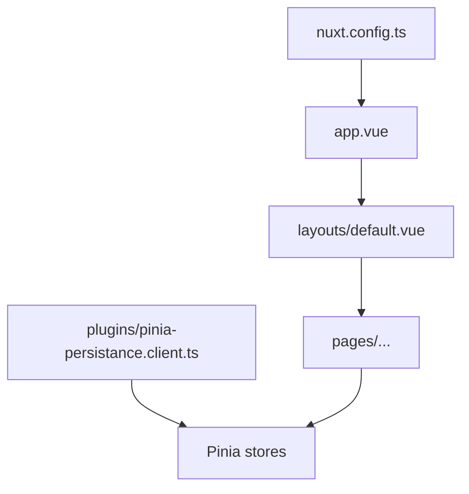
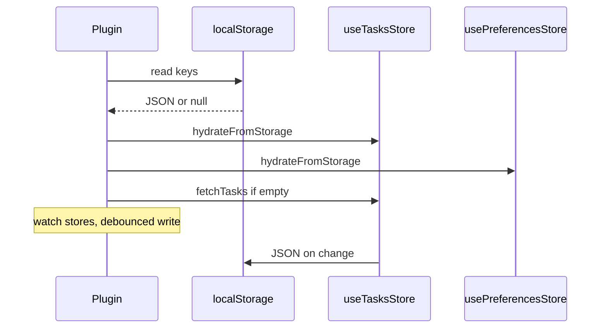

# Task Dashboard — developer guide (Vue 3 + Nuxt 3)

This document explains how the app boots, where state lives, and the Vue/Nuxt ideas you should know before changing code. It assumes you are comfortable with JavaScript or TypeScript and new to Vue or Nuxt.

---

## 1. What this project is

A small **Nuxt 3** app with:

- **Pages** for the dashboard (`/`) and task list (`/tasks`).
- **Pinia** stores for tasks, UI preferences, and toast notifications.
- A **client-only plugin** that loads and saves tasks and preferences in `localStorage`, and seeds tasks from a public API when there is nothing saved yet.

---

## 2. What runs first (boot order)

Roughly:

1. **Nuxt reads** [`nuxt.config.ts`](../nuxt.config.ts) and registers modules (`@pinia/nuxt`, Tailwind, color mode, and so on).
2. **Root component** [`app.vue`](../app.vue) renders `<NuxtLayout>` wrapping `<NuxtPage />`. That means: pick a layout, then render the current route’s page inside it.
3. **Default layout** [`layouts/default.vue`](../layouts/default.vue) adds the header, main area (`<slot />` = the page), and the notification stack.
4. **The active page** under `pages/` is rendered inside the layout slot.
5. **Plugins** run as part of Nuxt startup. This app’s persistence plugin is **client-only** (filename ends in `.client.ts`), so it runs in the browser, not during server render.

Official reference: [Nuxt directory structure](https://nuxt.com/docs/guide/directory-structure).



---

## 3. File-based routing (`pages/`)

Nuxt maps files in `pages/` to URLs:

| File | URL |
|------|-----|
| [`pages/index.vue`](../pages/index.vue) | `/` (dashboard) |
| [`pages/tasks.vue`](../pages/tasks.vue) | `/tasks` |

You do not register routes by hand; the file path **is** the route. More in the [Nuxt routing guide](https://nuxt.com/docs/getting-started/routing).

---

## 4. Vue 3 building blocks used here

### Single-File Components (`.vue`)

Each `.vue` file usually has:

- `<script setup lang="ts">` — logic for this component.
- `<template>` — HTML-like markup with Vue directives (`v-if`, `v-for`, `@click`, and so on).

[`script setup`](https://vuejs.org/api/sfc-script-setup.html) means top-level bindings (variables, functions, imports) are automatically available in the template.

### `ref` and `computed`

- **`ref(value)`** holds reactive state. In `<script setup>` you read or write `.value` (for example `tasks.value`). In templates, Vue unwraps refs for you, so you often write `tasks.length` instead of `tasks.value.length`.
- **`computed(() => ...)`** derives state from other reactive state. It re-runs when its dependencies change.

Pinia setup stores expose `ref`/`computed` from the store; components often use [`storeToRefs`](https://pinia.vuejs.org/core-concepts/#destructuring-from-a-store) to keep that reactivity when destructuring.

### `watch`

Runs a callback when tracked reactive data changes. The persistence plugin **watches** the tasks array (deep) and preference fields so it can save to `localStorage` after edits.

### Props and emits (parent ↔ child)

Example: [`TaskList.vue`](../components/TaskList.vue) receives `tasks` and `filteredEmptyMessage` as **props** and emits `toggle` / `delete` with a task id. The parent ([`pages/tasks.vue`](../pages/tasks.vue)) listens with `@toggle="toggleTask"` (Vue passes the payload for you).

Typed emits and props in this repo use `defineProps` / `defineEmits` with TypeScript interfaces.

---

## 5. Pinia stores (global state)

This app uses three stores:

| Store | Role |
|-------|------|
| [`stores/useTasksStore.ts`](../stores/useTasksStore.ts) | Task list, loading/error for fetch, CRUD actions, serialisation helpers for `localStorage`. |
| [`stores/usePreferencesStore.ts`](../stores/usePreferencesStore.ts) | Sort, filter, theme, sidebar collapsed; validates hydrated JSON field by field. |
| [`stores/useNotificationStore.ts`](../stores/useNotificationStore.ts) | Toast queue, auto-dismiss timers, optional confetti flag on a notification. |

All three use the **setup store** style: `defineStore('id', () => { ... return { ... } })`. That mirrors the Composition API (`ref`, `computed`, functions) in one place.

### Calling another store from an action

Task actions call `useNotificationStore().notify(...)` so user feedback stays centralized. That is simple to read but **couples** the task store to notifications (harder to unit test in isolation). For a learning app that trade-off is acceptable; in a larger app you might inject a notifier or use events.

### `storeToRefs` vs destructuring

**Do this** for reactive state you need in the template:

```ts
const taskStore = useTasksStore()
const { tasks, loading } = storeToRefs(taskStore)
const { addTask, toggleTask } = taskStore
```

**Avoid** destructuring reactive state directly from the store:

```ts
const { tasks } = useTasksStore() // wrong — `tasks` is no longer reactive
```

`storeToRefs` keeps refs reactive; plain destructuring of refs unwraps them incorrectly. Actions are plain functions, so you can take them from the store instance without `storeToRefs`.

---

## 6. Client plugin: persistence and first load

File: [`plugins/pinia-persistance.client.ts`](../plugins/pinia-persistance.client.ts).

- **`.client.ts`** — Nuxt only runs this on the client, which is what you want for `localStorage` and `window`.
- **`enforce: 'post'`** — runs **after** Pinia is ready so `useTasksStore()` and `usePreferencesStore()` work inside `setup()`.

### What the plugin does (in order)

1. **Read** JSON from `localStorage` (via a small helper that swallows parse errors).
2. **Hydrate** tasks and preferences stores from that JSON (invalid shapes are ignored so corrupt data does not wipe the UI).
3. Set **`colorMode.preference`** from the saved theme so the UI matches stored prefs.
4. If the task list is still **empty**, call **`fetchTasks()`** to load sample data from JSONPlaceholder.
5. **Watch** tasks (debounced) and preference fields (debounced) and write back to `localStorage`.
6. Watch **theme** and keep `colorMode` in sync when the user changes theme from preferences.
7. On **`pagehide`**, flush saves synchronously so a fast tab close does not lose the last edits.



---

## 7. Composables (reusable logic)

Nuxt **auto-imports** functions from the `composables/` folder.

| Composable | Purpose |
|------------|---------|
| [`composables/useTaskSorting.ts`](../composables/useTaskSorting.ts) | Builds sorted + filtered task lists and labels from the task and preferences stores. |
| [`composables/useConfettiOnLastNotification.ts`](../composables/useConfettiOnLastNotification.ts) | Watches notifications and triggers canvas confetti once per notification id when requested. |

Composables are just functions that can call `useXStore()`, `computed`, `watch`, and so on. They must run in a **Vue setup context** (for example inside `<script setup>` or another composable invoked from there).

---

## 8. Best practices this repo follows

- **TypeScript** for stores and components; strict mode enabled in Nuxt config.
- **Defensive `localStorage`**: try/catch around read/write so quota or privacy errors do not crash the app.
- **Versioned storage payloads** (`v: 1`) so you can migrate saved data later.
- **Accessibility**: labels on controls, `aria-live` for toasts, meaningful `aria-label`s on icon buttons.
- **Separation of concerns**: UI components mostly emit events or read props; pages wire stores to components.

---

## 9. Common pitfalls (especially for beginners)

1. **Losing reactivity** when destructuring Pinia state — use `storeToRefs` for refs from the store.
2. **Using browser APIs in shared code** without checking `import.meta.client` or using a `.client` plugin — `localStorage` is not available during SSR.
3. **Mutating complex props** — prefer emitting an event so the parent owns the data (this app mutates tasks inside the store, which is the single source of truth).
4. **Theme duplication** — both `@nuxtjs/color-mode` and the preferences store track theme. The plugin keeps them aligned: it applies prefs on load and watches `theme` to update `colorMode.preference`. The header toggle updates both when the user switches light/dark.

---

## 10. Commands and checks

| Command | Purpose |
|---------|---------|
| `pnpm dev` | Local development server. |
| `pnpm build` | Production build. |
| `pnpm typecheck` | Run `nuxt typecheck` / Vue compiler checks without starting a server. |

After refactors, run **`pnpm typecheck`** and click through: add/toggle/delete tasks, change filters and sort, reload the tab to confirm persistence, toggle theme.

---

## 11. Where to change what

| Goal | Start here |
|------|----------------|
| Change dashboard copy or cards | `pages/index.vue` |
| Change task page layout | `pages/tasks.vue` |
| Change task business rules or API | `stores/useTasksStore.ts` |
| Change sort/filter defaults or validation | `stores/usePreferencesStore.ts` |
| Change toast behavior or timing | `stores/useNotificationStore.ts` |
| Change save/load timing | `plugins/pinia-persistance.client.ts` |
| Change global chrome | `layouts/default.vue`, `components/AppHeader.vue` |

---

## 12. Further reading

- [Vue 3 documentation](https://vuejs.org/guide/introduction.html)
- [Nuxt 3 documentation](https://nuxt.com/docs/getting-started/introduction)
- [Pinia documentation](https://pinia.vuejs.org/introduction.html)
